# Home SOC Lab

## Overview

This project demonstrates a Windows-based Security Operations Center (SOC) home lab built to practice security monitoring, threat detection, log analysis, and incident investigation.

The lab uses **Splunk Enterprise** as the SIEM and **Sysmon** for detailed Windows endpoint telemetry. A **Kali Linux VM** is used to simulate network reconnaissance against the Windows endpoint.

The project includes five detection scenarios:

1. Windows Reconnaissance Detection
2. Suspicious PowerShell Detection
3. Persistence Detection
4. Suspicious File Execution Detection
5. Network Reconnaissance Detection using Nmap

---

## Lab Environment

- **Windows 10 VM** — Monitored endpoint
- **Kali Linux VM** — Attack simulation
- **Splunk Enterprise** — SIEM and log analysis
- **Sysmon** — Windows endpoint telemetry
- **Nmap** — Network reconnaissance
- **Windows Firewall Logging** — Network activity monitoring
- **Oracle VirtualBox** — Virtualization platform

### Lab Architecture

```text
                    +-----------------------+
                    |     Kali Linux VM     |
                    |    192.168.50.10      |
                    |                       |
                    |  Nmap Reconnaissance  |
                    +-----------+-----------+
                                |
                                | Network Scan
                                v
                    +-----------------------+
                    |     Windows 10 VM     |
                    |    192.168.50.20      |
                    |                       |
                    | Sysmon + Firewall Logs|
                    +-----------+-----------+
                                |
                                | Security Events
                                v
                    +-----------------------+
                    |  Splunk Enterprise    |
                    |                       |
                    | Search & Investigation|
                    +-----------------------+
```

---

# Detection Scenarios

## Scenario 1 — Windows Reconnaissance Detection

### Objective

Simulate common Windows reconnaissance activity and identify the resulting process creation events using Sysmon and Splunk.

### Activity Performed

Several native Windows commands were executed to gather information about the system:

```cmd
whoami
hostname
ipconfig
systeminfo
net user
tasklist
```

These commands can be used legitimately by administrators, but similar commands may also be used by an attacker after gaining access to a system to gather information about the host, users, network configuration, and running processes.

### Detection

Sysmon **Event ID 1 (Process Creation)** events were analyzed in Splunk.

The investigation captured:

- Process image
- Command line
- Parent process
- User
- Timestamp

### Result

Splunk successfully displayed the reconnaissance commands executed on the Windows endpoint, demonstrating how endpoint telemetry can be used to investigate system discovery activity.

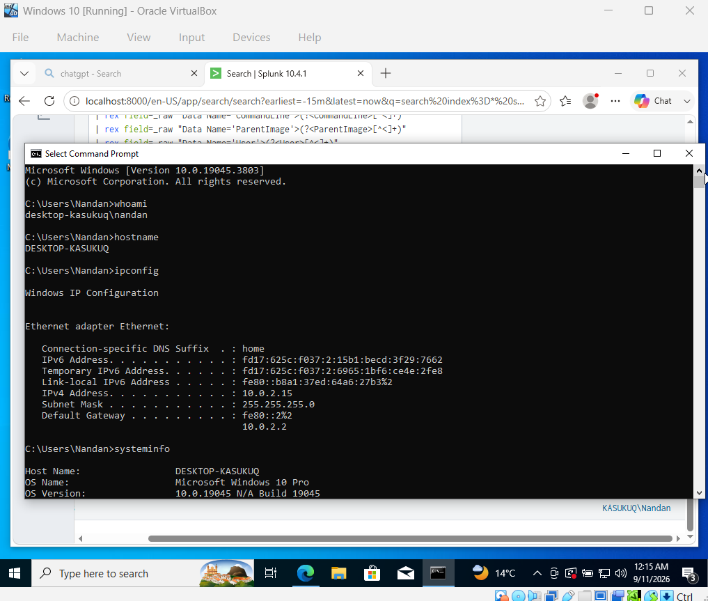

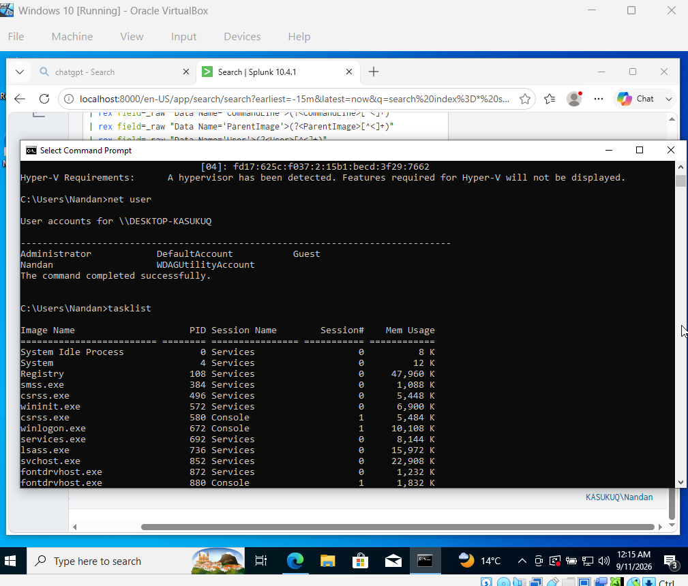

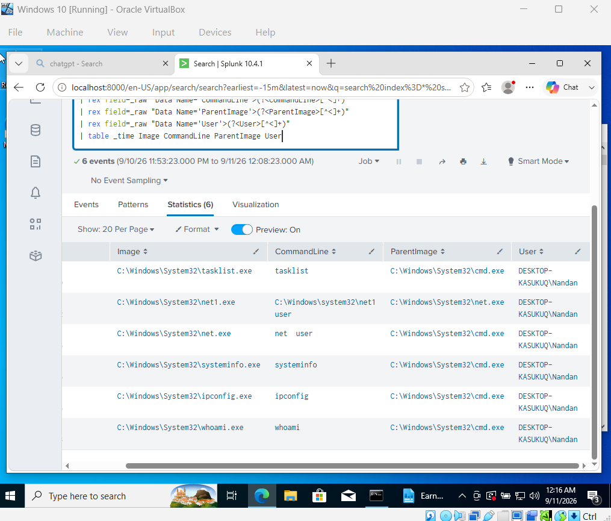

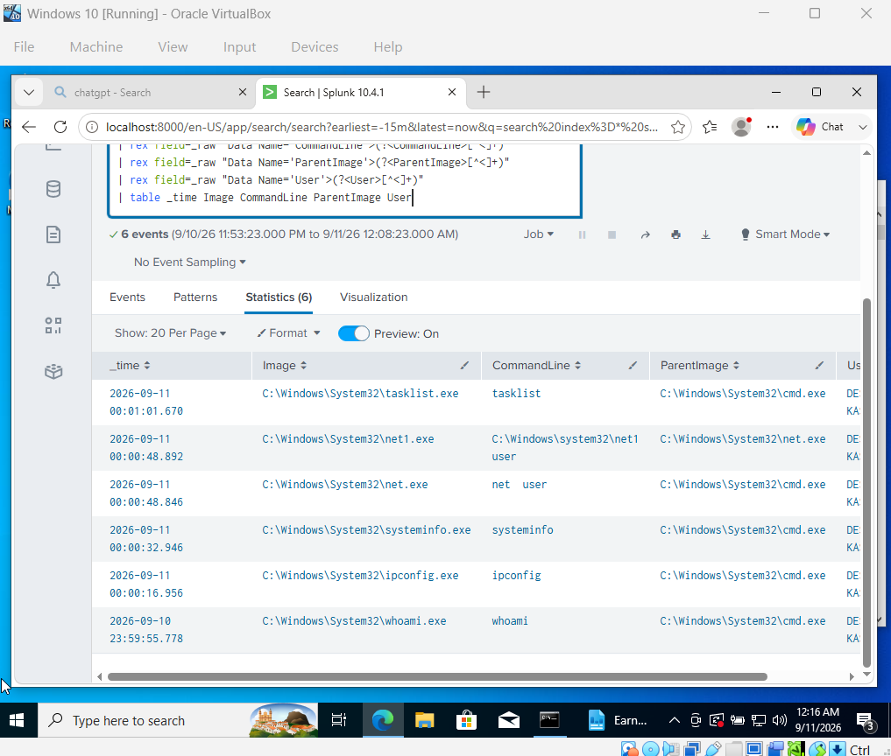

---

## Scenario 2 — Suspicious PowerShell Detection

### Objective

Detect potentially suspicious PowerShell execution by monitoring command-line arguments using Sysmon and Splunk.

### Activity Performed

A harmless PowerShell command was executed using options that can be worth investigating in a SOC environment:

```powershell
Get-Date
powershell.exe -NoProfile -ExecutionPolicy Bypass -Command "Write-Output 'SOC Lab Test'"
```

The command was used only for lab testing. However, `ExecutionPolicy Bypass` can be an important indicator for analysts because attackers may use PowerShell with policy-bypass options during malicious activity.

### Detection

Splunk was used to search Sysmon **Event ID 1** events for PowerShell execution containing `ExecutionPolicy` and `Bypass`.

The investigation captured:

- PowerShell executable
- Full command line
- Parent process
- User
- Timestamp

### Result

The PowerShell execution was successfully identified in Splunk, demonstrating how command-line telemetry can help analysts investigate potentially suspicious PowerShell activity.

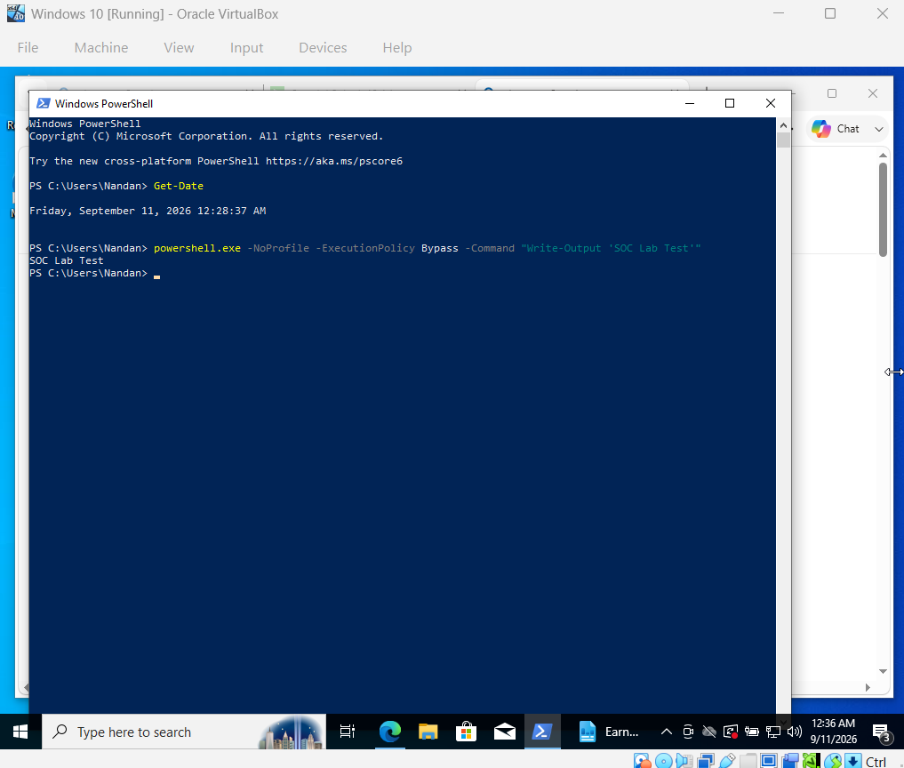

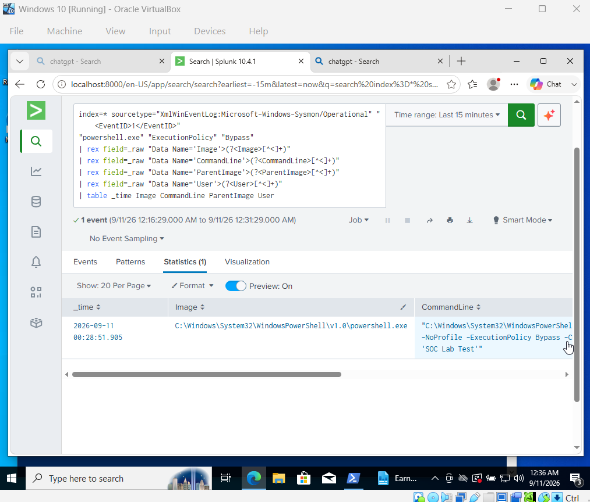

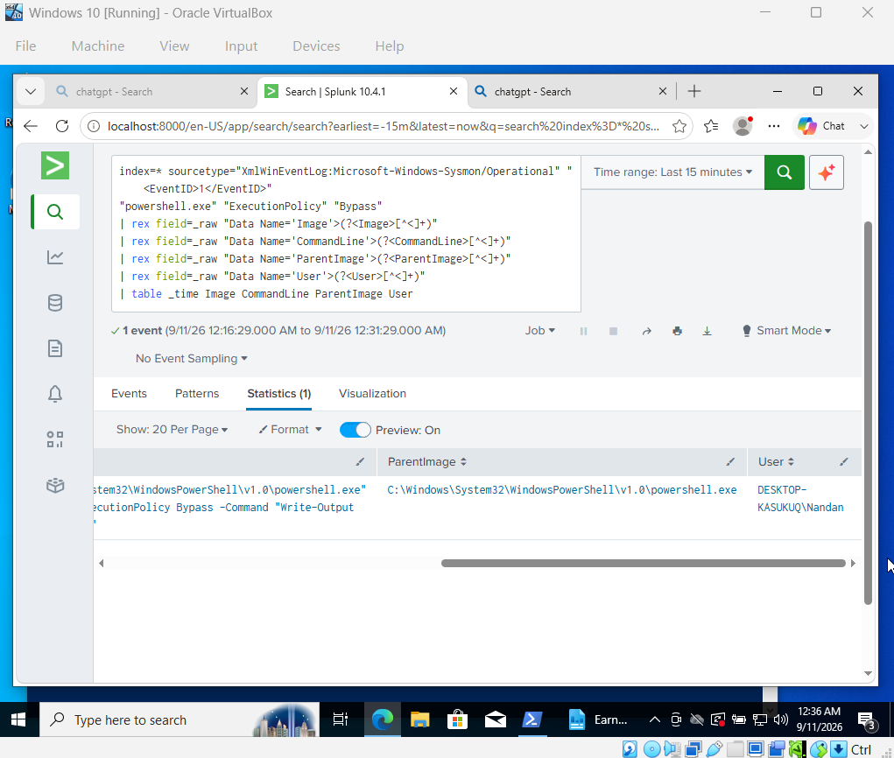

---

## Scenario 3 — Persistence Detection

### Objective

Simulate a basic persistence technique using a Windows Scheduled Task and identify its creation through endpoint telemetry.

### Activity Performed

A scheduled task named `SOC-Lab-Persistence` was created:

```cmd
schtasks /create /tn "SOC-Lab-Persistence" /tr "notepad.exe" /sc onlogon /f
```

The task was configured to execute Notepad when a user logs on.

Scheduled tasks are a legitimate Windows feature, but attackers may abuse them to automatically execute programs and maintain persistence on compromised systems.

The scheduled task was verified using:

```cmd
schtasks /query /tn "SOC-Lab-Persistence"
```

### Detection

Splunk was used to identify the execution of `schtasks.exe` with the `/create` argument within Sysmon **Event ID 1** process creation events.

The investigation showed:

- Process image
- Scheduled task creation command
- Parent process
- User
- Timestamp

### Result

The scheduled-task creation activity was successfully identified in Splunk, demonstrating how process telemetry can reveal activity associated with persistence mechanisms.

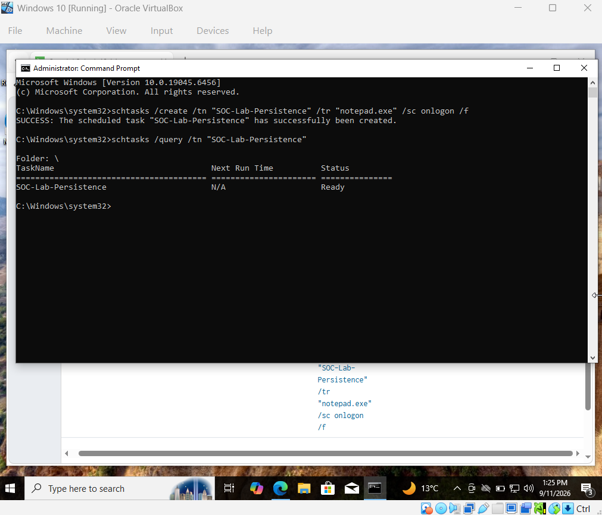

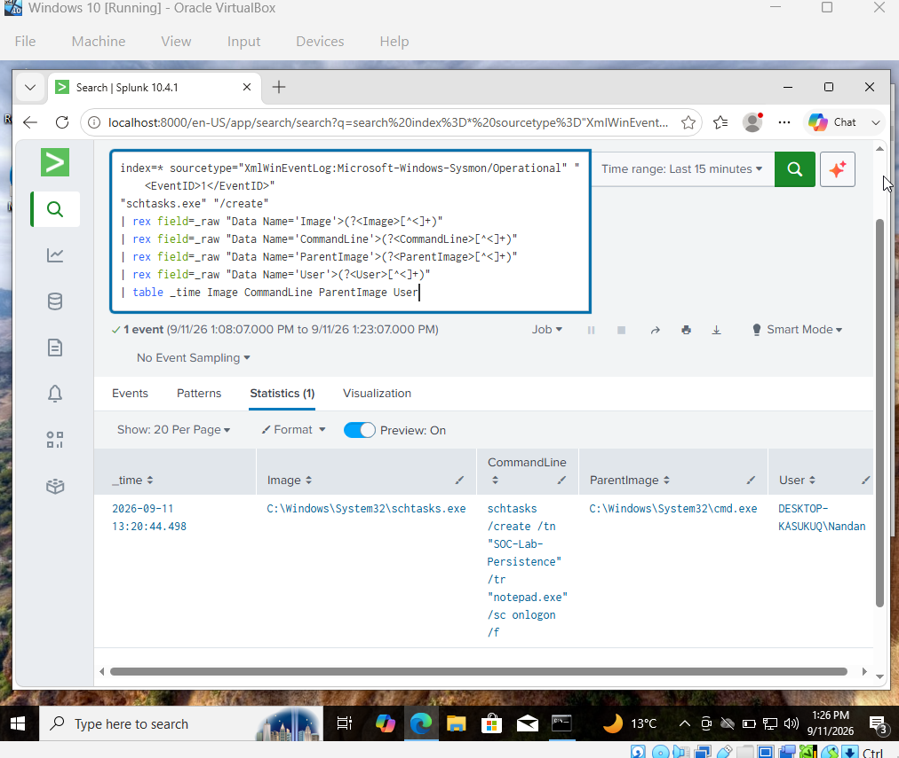

---

## Scenario 4 — Suspicious File Execution Detection

### Objective

Demonstrate how an executable running from a user-controlled directory with a misleading filename can be investigated using Sysmon and Splunk.

### Activity Performed

The legitimate Windows Calculator executable was copied into the Downloads directory and renamed:

```cmd
copy C:\Windows\System32\calc.exe C:\Users\Nandan\Downloads\suspicious-test.exe
```

The renamed executable was then executed:

```cmd
C:\Users\Nandan\Downloads\suspicious-test.exe
```

Calculator opened normally, but from a monitoring perspective the executable was now running from the user's Downloads directory under a different filename.

### Detection

Sysmon **Event ID 1** captured the process execution.

Splunk was used to investigate:

- Executable path
- Command line
- Parent process
- User
- File hashes
- Timestamp

### Result

Splunk successfully identified `suspicious-test.exe` executing from the Downloads directory.

The Sysmon event also provided file hashes, demonstrating how analysts can use hashes and process metadata when investigating suspicious executables rather than relying only on filenames.

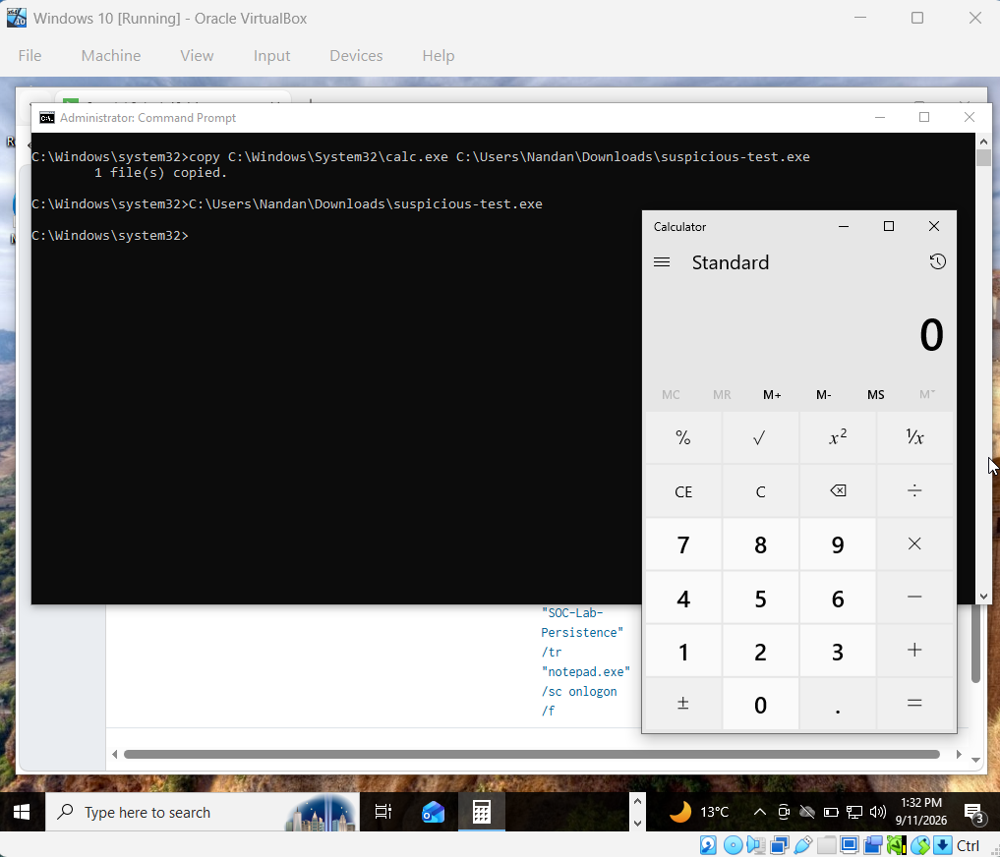

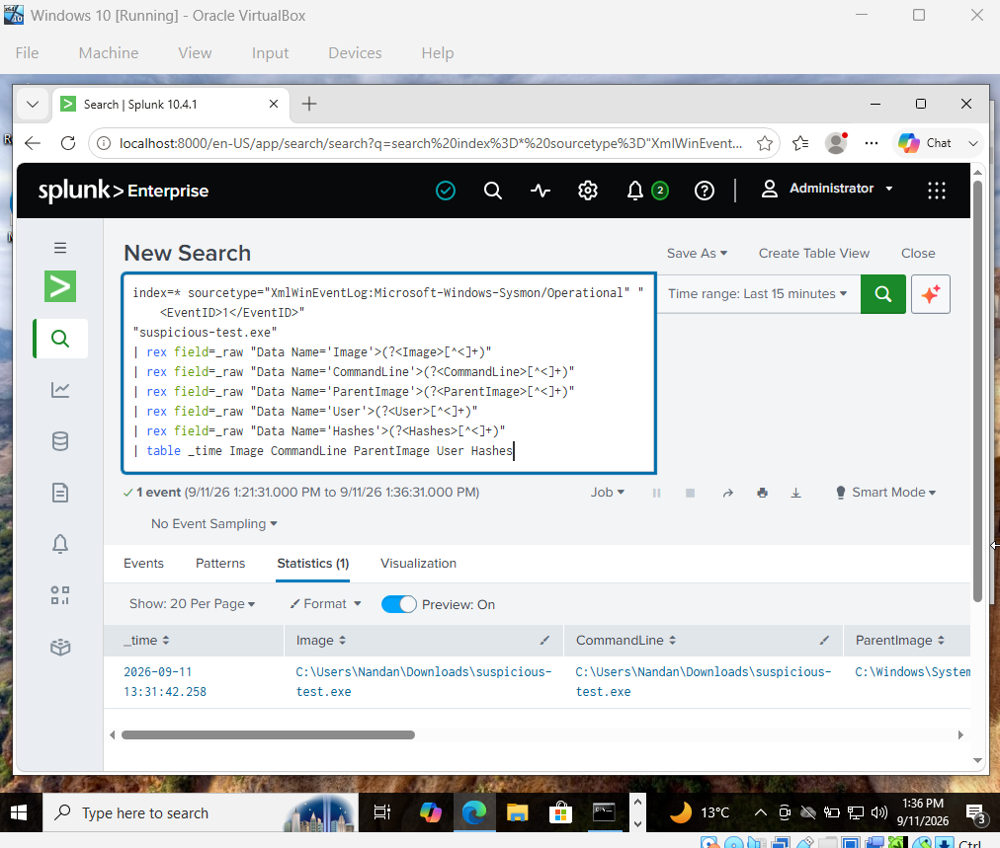

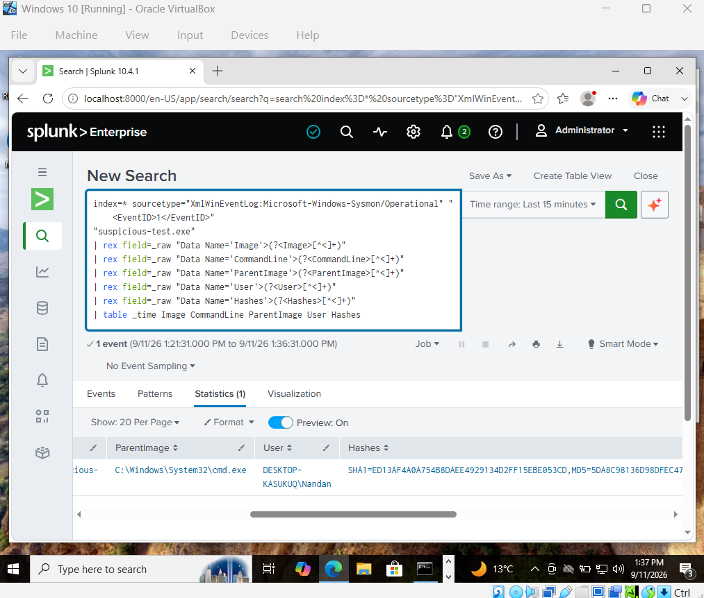

---

## Scenario 5 — Network Reconnaissance Detection Using Nmap

### Objective

Simulate network reconnaissance from a Kali Linux system against the Windows endpoint and identify evidence of the scan using Windows Firewall logs.

### Lab Network

```text
Kali Linux:  192.168.50.10
Windows 10:  192.168.50.20
```

Both virtual machines were configured on the same lab network, allowing Kali Linux to communicate directly with the Windows endpoint.

### Activity Performed

An Nmap scan was launched from Kali Linux against the Windows VM:

```bash
nmap -Pn 192.168.50.20
```

Nmap attempted connections to multiple TCP ports on the target system.

The scan confirmed that the Windows host was online while the scanned TCP ports were filtered.

### Detection

Windows Firewall dropped-connection logging was enabled on the Windows VM.

The firewall logs showed repeated TCP connection attempts with:

```text
Source IP:      192.168.50.10
Destination IP: 192.168.50.20
Action:         DROP
Protocol:       TCP
```

Multiple destination ports were contacted within a short period, providing evidence consistent with the Nmap reconnaissance activity performed from Kali.

### Result

The exercise demonstrated both sides of a basic network reconnaissance investigation.

**Attacker side:** Kali Linux generated the Nmap scan.

**Defender side:** Windows Firewall logs recorded and blocked incoming connection attempts from the Kali Linux IP address.

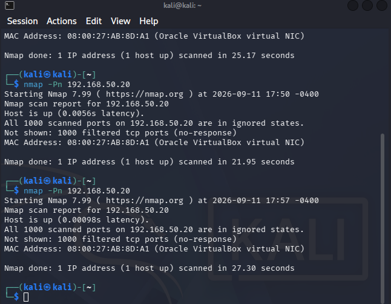

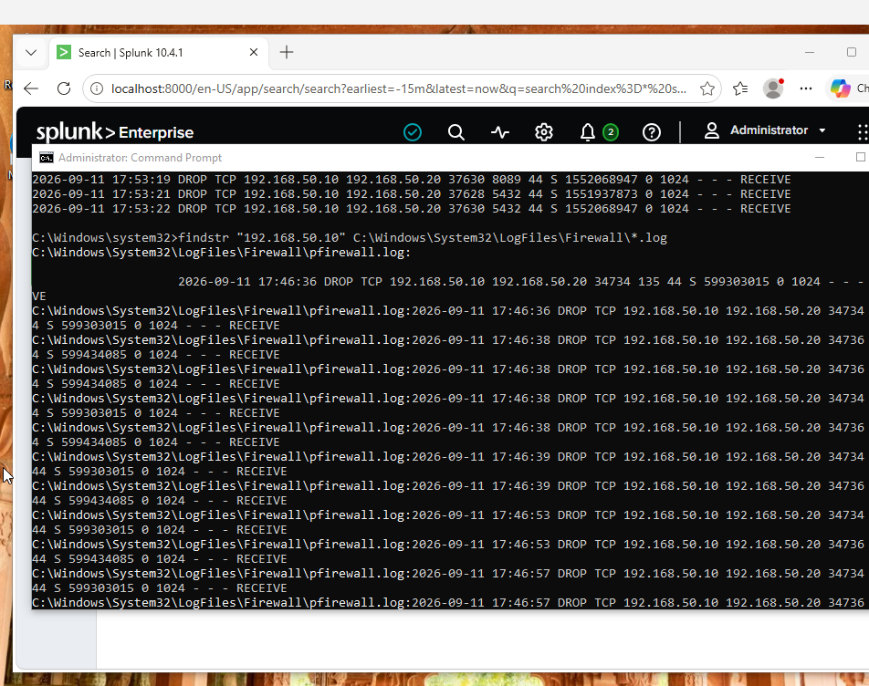

---

# Skills Demonstrated

This project provided hands-on experience with:

- SIEM monitoring and log analysis
- Splunk Search Processing Language (SPL)
- Sysmon event analysis
- Windows process creation analysis
- Command-line investigation
- Suspicious PowerShell detection
- Persistence technique detection
- File execution and hash investigation
- Windows Firewall log analysis
- Network reconnaissance using Nmap
- Basic incident investigation
- Windows and Linux virtual machines

---

# Key Takeaways

This lab demonstrates a basic SOC investigation workflow:

```text
Generate Activity
       ↓
Collect Endpoint / Network Logs
       ↓
Ingest and Search Security Events
       ↓
Identify Suspicious Activity
       ↓
Analyze Process / Network Evidence
       ↓
Document Findings
```

Through these scenarios, I gained practical experience understanding how endpoint and network activity appears in security logs and how a SOC analyst can use SIEM and endpoint telemetry to investigate suspicious behavior.

---

## Disclaimer

All activities in this project were performed in an isolated home lab environment using personally controlled virtual machines for educational and cybersecurity training purposes.
